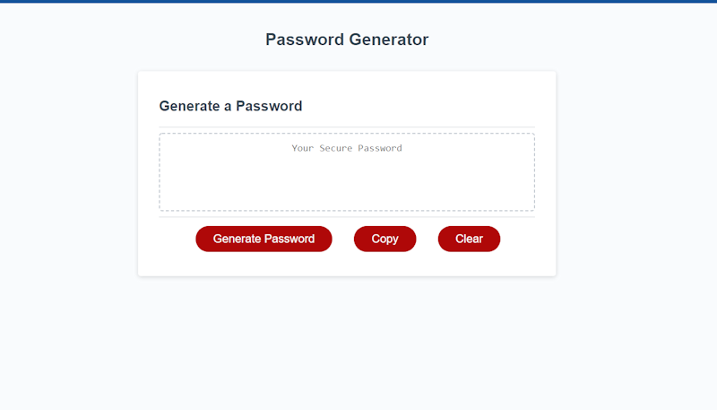

# Password Generator

## Purpose
A user can generate a random password based on criteria they've selected (Uppercase, Lowercase, Numbers, and Special Characters). They can copy the password link to their clipboard via a button or clear the form to generate a new password.

## Built With
* JavaScript
* HTML
* CSS

## Website
https://coevpen.github.io/password-generator/

## Screenshot

